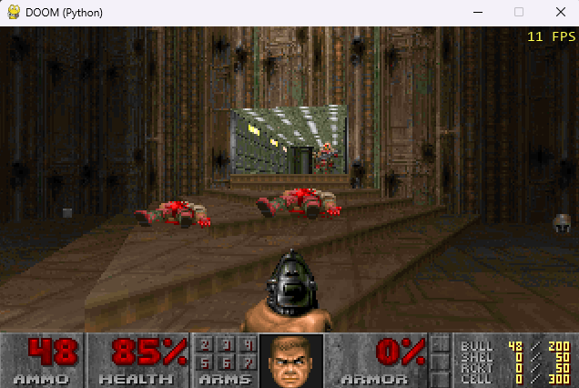

# python_doom



**Video:** [DOOM running in Python](https://youtu.be/2JdJ5zfdmkg)

DOOM generic ported from Harbour to **Python 3 + pygame**.

By **Wagner Nunes da Silva**

- vagucs@bol.com.br
- vagucs@vagucs.com.br
- vagucs@gmail.com
- [www.vagucs.com.br](https://www.vagucs.com.br)
- [LinkedIn](https://www.linkedin.com/in/wagner-nunes-da-silva-b0a15360)

Same engine in other languages: [harbour_doom](https://github.com/vagucs/harbour_doom) · [python_doom](https://github.com/vagucs/python_doom) · [php_doom](https://github.com/vagucs/php_doom) · [node_doom](https://github.com/vagucs/node_doom) · [java_doom](https://github.com/vagucs/java_doom)

This tree is a port of **[harbour_doom](https://github.com/vagucs/harbour_doom)** (`doom_hb`): the same Chocolate Doom / doomgeneric engine that first went from C to Harbour, now from Harbour to Python.

Versão em português: [README.pt.md](README.pt.md)

---

## What this project is

The Chocolate Doom / doomgeneric engine was translated to **Harbour** (`.prg` / `.ch`) with a thin C layer for Allegro 4.2.2. That work lives at [github.com/vagucs/harbour_doom](https://github.com/vagucs/harbour_doom). This directory is the **same study piece again**, in Python:

- Window and blit: **pygame** (no Allegro, no joystick, no CD-Audio, no net)
- Framebuffer: 320×200, 8-bit PLAYPAL, scaled to the window
- Game tick: 35 Hz (`TICRATE`), same as vanilla
- Renderer: BSP, visplanes, `R_DrawColumn` / `R_DrawSpan`, 16.16 `fixed_mul` / `fixed_div`
- Map: VERTEXES, LINEDEFS, SIDEDEFS, SECTORS, SEGS, SSECTORS, NODES, THINGS, BLOCKMAP, REJECT
- Play: walk, doors, lifts, switches, exit, pickups, weapons (including chainsaw raise/cut), status bar, Tab automap, DS* sound, MUS music, ESC menu (options, load/save), intermission tally, melt wipe, monster look/chase/attack

You need a legal IWAD (shareware `doom1.wad` or commercial `doom.wad` / `doom2.wad` / etc.). This repository does not ship commercial WAD data.

It is a **condensed educational port** (~25 Python modules vs 100+ Harbour `.prg` files): playable, Harbour-like speed and behavior, not a 1:1 dump of every thinker table.

Not in this Python tree (same cut as Harbour `boot.prg`, plus a few full-engine pieces still only in Harbour):

- Network, CD music, joystick
- `-colors` palette quantize (Harbour-only experiment)
- Demo playback, bunny scroll, full `info` state tables

---

## Educational purpose

This project is, above all, a **study piece**. DOOM (1993) is small enough to read end to end and dense enough to teach real engine work: BSP rendering, 16.16 fixed-point, a tic-based loop, a WAD file system.

The Harbour port taught how to read C in another language. The Python port makes the next step explicit: there is no preprocessor, no 1-based arrays, and no C bit-ops hiding in `#translate`.

What it is meant to teach:

- **Six languages, one engine.** C (`base_c/` in harbour_doom) → Harbour ([harbour_doom](https://github.com/vagucs/harbour_doom)) → Python ([python_doom](https://github.com/vagucs/python_doom)) → PHP ([php_doom](https://github.com/vagucs/php_doom)) → TypeScript ([node_doom](https://github.com/vagucs/node_doom)) → Java ([java_doom](https://github.com/vagucs/java_doom)). Same names (`P_Thrust`, `R_DrawColumn`, `A_Look`) so you can open the versions side by side.
- **What pointers were doing.** Python uses objects and lists; wrap-around, BAM angles and 16.16 overflow stay explicit (`as_u32`, `shar`, `fixed_mul`) because Python integers do not wrap.
- **Where an interpreter is enough.** The whole game runs in Python. pygame talks to the window/mixer; numpy speeds the 8-bit→RGB blit and the optional CRT filter.
- **Legacy modernization.** Keep behavior identical, isolate the native layer, verify against the original.

Suggested way to study:

1. Run it, then read `main.py` and `doom/game.py` — boot, tic, input.
2. Compare `doom/compat.py` with Harbour `xhb_compat.prg` / `m_fixed.prg`.
3. Open `doom/render.py` next to `r_main.prg` / `r_bsp.prg` / `r_segs.prg` / `r_draw.prg`.
4. Follow a door from **Space** (`use_lines`) through `doom/specials.py`.
5. Follow a shot from **Ctrl** in `doom/player.py` (`p_pspr`) to `line_attack` and `A_Look`.

---

## From C / Harbour to Python

Python is 0-based, like the C in harbour_doom `base_c/`. Harbour arrays were 1-based; that offset is gone here.

The table below is the same six-language comparison used in every `*_doom` README:

| DOOM in C                   | [Harbour](https://github.com/vagucs/harbour_doom) | [Python](https://github.com/vagucs/python_doom) | [PHP](https://github.com/vagucs/php_doom) | [Node](https://github.com/vagucs/node_doom) | [Java](https://github.com/vagucs/java_doom) |
| --------------------------- | ------------------------------------------------- | ----------------------------------------------- | ---------------------------------------- | ------------------------------------------- | ------------------------------------------- |
| `struct` / `typedef struct` | `CLASS ... DATA`                                  | `@dataclass`                                    | `class` + typed properties               | `class` + typed fields                      | `class` + fields                            |
| `thing->x`                  | `thing:x`                                         | `thing.x`                                       | `$thing->x`                              | `thing.x`                                   | `thing.x`                                   |
| `NULL`                      | `NIL`                                             | `None`                                          | `null`                                   | `null`                                      | `null`                                      |
| `array[0]`                  | `array[1]`                                        | `array[0]`                                      | `$array[0]`                              | `array[0]`                                  | `array[0]`                                  |
| `&`, `|`, `^`               | `hb_qbitAnd/Or/Xor`                               | `&`, `|`, `^`                                   | `&`, `|`, `^`                            | `&`, `|`, `^`                               | `&`, `|`, `^`                               |
| `x >> n` unsigned           | `UShr(x, n)`                                      | `ushr(x, n)`                                    | `Compat::ushr($x, $n)`                   | `ushr(x, n)`                                | `Compat.ushr` / `>>>`                       |
| `x >> n` signed             | `Shar(x, n)`                                      | `shar(x, n)`                                    | `Compat::shar($x, $n)`                   | `shar(x, n)`                                | `Compat.shar` / `>>`                        |
| 32-bit wrap                 | `AsU32` / `AsInt32`                               | `as_u32` / `as_i32`                             | `Compat::asU32` / `asI32`                | `asU32` / `asI32`                           | `int` already wraps                         |
| `fixed_t` 16.16             | `FixedMul` / `FixedDiv`                           | `fixed_mul` / `fixed_div`                       | `Compat::fixedMul` / `fixedDiv`          | `fixedMul` / `fixedDiv` (BigInt)            | `fixedMul` / `fixedDiv` (`long`)            |
| `byte *` framebuffer        | Harbour string                                    | `bytearray` + numpy LUT                         | `array<int>` + SDL ARGB8888              | `Uint8Array` + SDL ARGB8888                 | `int[]` + SDL ARGB8888                      |
| Allegro 4.2.2               | GTALLEG / llibg                                   | pygame                                          | SDL2 via FFI                             | SDL2 via koffi                              | SDL2 via JNA                                |
| `Z_Malloc`                  | GC                                                | GC                                              | GC                                       | GC                                          | GC                                          |
| `PUBLIC` globals            | `PUBLIC` / `MEMVAR`                               | fields on `Game`                                | public fields on `Game`                  | public fields on `Game`                     | public fields on `Game`                     |
| 100+ `.prg` files           | 1:1 with C                                        | condensed `doom/*.py`                           | condensed `src/*.php`                    | condensed `src/*.ts`                        | condensed `src/doom/*.java`                 |

### Side-by-side: `P_Thrust`

C (`base_c/p_user.c` in harbour_doom):

```c
void P_Thrust (player_t* player, angle_t angle, fixed_t move)
{
    angle >>= ANGLETOFINESHIFT;
    player->mo->momx += FixedMul(move,finecosine[angle]);
    player->mo->momy += FixedMul(move,finesine[angle]);
}
```

Harbour (`p_user.prg`):

```harbour
PROCEDURE P_Thrust( player, angle, move )
    angle := UShr( angle, ANGLETOFINESHIFT )
    player:mo:momx += FixedMul( move, finecosine[ angle + 1 ] )
    player:mo:momy += FixedMul( move, finesine[ angle + 1 ] )
RETURN
```

Python (`doom/player.py`):

```python
def thrust(mo, angle, move):
    mo.momx += fixed_mul(move, fine_cos(angle))
    mo.momy += fixed_mul(move, fine_sin(angle))
```

`->` becomes `.`, unsigned shift becomes `ushr` (or a fine-table helper), and the Harbour `+ 1` index offset disappears.

---

## Technology

| Layer | This port | Harbour (`harbour_doom`) |
|---|---|---|
| Language | Python 3.10+ (tested on 3.12) | Harbour / xHarbour |
| Window, keys, mixer | pygame 2.x | Allegro 4.2.2 + GTALLEG |
| Palette blit / CRT | numpy | C in `doomgeneric_allegro.prg` |
| IWAD | same WAD lumps | same |
| Build | `pip install -r requirements.txt` | `compile.bat` / `hbmk2` |

Dependencies (`requirements.txt`):

```
pygame>=2.5
numpy>=1.24
```

---

## Performance

Typical blit rate on the same PC (320×200, windowed, shareware IWAD). The game still ticks at 35 Hz (`TICRATE`); `-fps` shows this number.

| Port | Typical FPS |
|---|---|
| Harbour (`doom_hb`) | ~12 |
| Python (`python_doom`) | ~8 |
| PHP (`php_doom`) | ~20 |
| Node (`node_doom`) | ~100 |
| Java (`java_doom`) | ~180 (vsync-locked) |

---

## How to run

Python 3.10+. From this directory:

```
pip install -r requirements.txt
python main.py
python main.py -iwad DOOM1.WAD
python main.py -iwad ..\DOOM1.WAD -warp 1 1 -fps
python main.py -iwad DOOM1.WAD -crt
```

Or `python -m doom` from this folder.

With no `-iwad` it looks for a `.wad` argument, then `doom1.wad` / `DOOM1.WAD` / `doom.wad` / `doom2.wad` in the current directory, `DOOMWADDIR`, and the parent `doom_minimal` folder.

---

## Keys

Classic DOOM controls (this condensed port; not remapped via `default.cfg`).

### Movement and actions

| Key | Action |
|---|---|
| Arrow keys | Forward, back, turn |
| **Shift** | Run |
| **Alt** | Strafe (hold) |
| **,** / **.** | Strafe left / right |
| **Ctrl** | Fire (hold to repeat; weapon animation + `A_ReFire`) |
| **Space** / **E** | Use / open door |
| **1** | Fist / chainsaw (toggle) |
| **2**–**7** | Pistol, shotgun, chaingun, rocket, plasma, BFG |
| **Enter** | Start from the title |
| **Tab** | Automap (toggle). **+** / **-** zoom, **0** fit map, **F** follow, **G** grid, **M** mark, **C** clear marks |
| **Esc** | Menu |
| **F2** | Save |
| **F3** | Load |
| **F11** | Toggle FPS overlay |
| **Alt+Enter** | Fullscreen |
| **+** / **-** | Window scale (1–6); zoom the automap while it is open |

Options **Screen Size** and **Graphic Detail** (HIGH/LOW) change the 3D view (`R_SetViewSize`), not the window scale.

Movement is **arrow keys only** (no WASD), so letter keys stay free for cheat codes.

### Cheats (nostalgia only)

Type these on the keyboard during play; no Enter needed. On Nightmare skill only **IDCLEV** and **IDDT** work (vanilla).

| Code | Effect |
|---|---|
| **IDDQD** | God mode (_Degreelessness Mode_) |
| **IDKFA** | All weapons, ammo, keys, and armor |
| **IDFA** | Weapons, ammo, and armor (no keys) |
| **IDCLIP** / **IDSPISPOPD** | No clipping |
| **IDDT** | Automap cheat (type while the map is open): all walls, then things |
| **IDBEHOLD** | Lists power-ups; then **V** invulnerability, **S** berserk, **I** invisibility, **R** radiation suit, **A** computer map, **L** light visor |
| **IDCHOPPERS** | Chainsaw |
| **IDMYPOS** | Print angle and coordinates |
| **IDCLEV** + 2 digits | Warp (`11` = E1M1 or MAP11) |
| **IDMUS** + 2 digits | Change music (`11` = E1M1 / MAP11 track) |

---

## Command-line parameters

### IWAD

| Parameter | Description |
|---|---|
| `-iwad file.wad` | IWAD to load (path or filename) |
| `file.wad` | Same thing, without `-iwad` |

### Video

| Parameter | Description |
|---|---|
| `-fullscreen` | Start in a fullscreen window |
| `-crt` | CRT filter from Harbour `CrtBuild` / `CrtRender`: tube curvature, scanlines, RGB phosphor mask, vignette. Scanlines/mask show clearly at scale 2× or more |
| `-fps` | Show frames per second at the top-right |

### Game

| Parameter | Description |
|---|---|
| `-warp e m` | Skip the title and start episode `e` map `m` |
| `-skill n` | 0 baby … 4 nightmare (default 2, Hurt Me Plenty) |
| `-nomonsters` | Do not spawn enemies |
| `-fast` | Faster monsters (vanilla `-fast`) |
| `-respawn` | Nightmare-style respawn |
| `-file wad [wad…]` | Extra PWADs after the IWAD |
| `-record name` | Record a demo to `name.lmp` |
| `-playdemo name` | Play a lump or `.lmp` file, then quit |
| `-timedemo name` | Playback as fast as possible and print FPS |
| `-nosound` | Disable SFX and music |
| `-nomusic` | Disable music only |

`default.cfg` in the working directory stores `mouse_sensitivity`, `sfx_volume`, `music_volume`, `show_messages`, `use_mouse`, `screenblocks`. Mouse look/walk uses pygame relative motion when `use_mouse` is on. Saves stay JSON (vanilla binary save is not used).

Harbour-only flags **not** implemented here: `-videoc`, `-scaling`, `-gfxmode`, `-colors`, net/CD/joystick.

---

## Layout

```
main.py              entry: python main.py
requirements.txt     pygame, numpy
doom/                engine package
screenshot/doom.png  README screenshot
```

| Path | Vanilla / Harbour |
|---|---|
| `doom/compat.py` | `m_fixed`, `xhb_compat` |
| `doom/wad.py` | `w_wad` |
| `doom/video.py` | `i_video`, `doomgeneric_allegro` (including `-crt`) |
| `doom/v_video.py` | `v_video` |
| `doom/tables.py` | `tables` |
| `doom/r_data.py` | `r_data` |
| `doom/render.py` | `r_main` `r_bsp` `r_segs` `r_plane` `r_draw` |
| `doom/world.py` | `p_setup` |
| `doom/collision.py` | `p_map` `p_maputl` `p_sight` (REJECT) |
| `doom/player.py` | `p_user` `p_pspr` |
| `doom/specials.py` | `p_spec` `p_doors` `p_plats` `p_floor` `p_switch` |
| `doom/mobj.py` | `info` `p_inter` |
| `doom/sprites.py` | `r_things` |
| `doom/enemy.py` | `p_enemy` (look / chase / attack) |
| `doom/status.py` | `st_stuff` |
| `doom/am_map.py` | `am_map` |
| `doom/sound.py` | `i_sound`, `i_allegrosound` CacheSFX |
| `doom/mus2mid.py` | `mus2mid.c` |
| `doom/menu.py` | `m_menu` |
| `doom/saveg.py` | `p_saveg` (24-byte name + JSON) |
| `doom/wi_stuff.py` | `wi_stuff` |
| `doom/wipe.py` | `f_wipe` melt |
| `doom/finale.py` | `f_finale` |
| `doom/game.py` | `d_main` `g_game` `d_loop` `boot` |

---

## Lineage

1. **id Software DOOM** (1993) — original engine
2. **Chocolate Doom / doomgeneric** — portable C
3. **[harbour_doom](https://github.com/vagucs/harbour_doom)** — Harbour + Allegro 4.2.2 (`Doom_hb.exe`)
4. **[python_doom](https://github.com/vagucs/python_doom)** — Python + pygame (this tree)
5. **[php_doom](https://github.com/vagucs/php_doom)** — PHP 8 CLI + SDL2 FFI
6. **[node_doom](https://github.com/vagucs/node_doom)** — Node.js CLI + TypeScript + SDL2 (koffi)
7. **[java_doom](https://github.com/vagucs/java_doom)** — Java 17 CLI + SDL2 (JNA)

---

## Donate

### Ethereum

`0x1b64038A2b1DB73ABd0068d8B9B0d1dC5a90C5F1`


### PIX

Key: `vagucs@bol.com.br`


